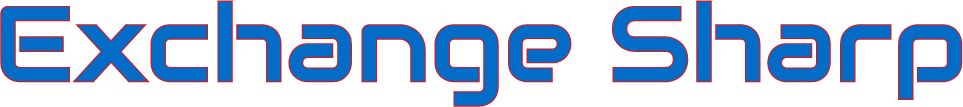

[](https://dev.azure.com/DigitalRuby/DigitalRuby/_build/latest?definitionId=5&branchName=master)

## Overview
ExchangeSharp is a C# console app and framework for trading and communicating with various exchange API end points for cryptocurrency assets. Many exchanges are supported, along with web sockets, withdraws and more!

### Features
- Many exchanges supported with public, private and web socket API
- Easy to use and well documented code and API
- Optional global market symbol normalization, since each exchange has their own way of doing market symbols
- Runs anywhere .NET core will run (Windows 8.1 or newer, MAC, Linux, iOS, Android, Unity 2018+, etc.)

### Exchanges
The following cryptocurrency exchanges are supported:  
(Web socket key: T = tickers, R = trades, B = order book, O = private orders)

|Exchange Name     |Public REST|Private REST |Web Socket |
| ---------------- | --------- | ----------- | --------- |
| Abucoins         | x         | x           | TRO       |
| Binance          | x         | x           | TRB       |
| Bitbank          | x         | x           |           |
| Bitfinex         | x         | x           | TRO       |
| Bithumb          | x         |             |           |
| BitMEX           | x         | x           | RO        |
| Bitstamp         | x         | x           |           |
| Bittrex          | x         | x           | TR        |
| Bleutrade        | x         | x           |           |
| Coinbase         | x         | x           | TR        |
| Cryptopia        | x         | x           |           |
| Gemini           | x         | x           |           |
| Hitbtc           | x         | x           |           |
| Huobi            | x         | x           | RB        |
| Kraken           | x         | x           |           |
| KuCoin           | x         | x           | TR        |
| LBank            | x         | x           |           |
| Livecoin         | x         | x           |           |
| OKex             | x         | x           | RB        |
| Poloniex         | x         | x           | TRB       |
| TuxExchange      | x         | x           |           |
| YoBit            | x         | x           |           |
| ZB.com           | wip       |             | R         |

The following cryptocurrency services are supported:
- Cryptowatch (partial)

### Notes
ExchangeSharp uses 'marketSymbol' to refer to markets, or pairs of currencies.

Please send pull requests if you have made a change that you feel is worthwhile, want a bug fixed or want a new feature. You can also donate to get new features.

### Building
Visual Studio 2017 is recommended. .NET 4.7.2+ or .NET core 2.2+ is required.
If running on Windows, you should use Windows 8.1 or newer.

If you must use an older Windows, you'll need to use the Websocket4Net nuget package, and override the web socket implementation by calling

```ExchangeSharp.ClientWebSocket.RegisterWebSocketCreator(() => new ExchangeSharpConsole.WebSocket4NetClientWebSocket());```

See WebSocket4NetClientWebSocket.cs for implementation details.
```
Windows: Open ExchangeSharp.sln in Visual Studio and build/run  
Other Platforms: dotnet build ExchangeSharp.sln -f netcoreapp2.1
Ubuntu Release Example: dotnet build ExchangeSharp.sln -f netcoreapp2.1 -c Release -r ubuntu.16.10-x64
```

You can also publish from Visual Studio (right click project, select publish), which allows easily changing the platform, .NET core version and self-contained binary settings.

### Nuget
<a href='https://www.nuget.org/packages/DigitalRuby.ExchangeSharp/'>  
``` PM> Install-Package DigitalRuby.ExchangeSharp -Version 0.6.0 ```  
</a> 

### Simple Example
```
ExchangeKrakenAPI api = new ExchangeKrakenAPI();
ExchangeTicker ticker = api.GetTickerAsync("XXBTZUSD").Sync();
Console.WriteLine("On the Kraken exchange, 1 bitcoin is worth {0} USD.", ticker.Bid);

// load API keys created from ExchangeSharpConsole.exe keys mode=create path=keys.bin keylist=public_key,private_key
api.LoadAPIKeys("keys.bin");

/// place limit order for 0.01 bitcoin at ticker.Ask USD
ExchangeOrderResult result = api.PlaceOrderAsync(new ExchangeOrderRequest
{
    Amount = 0.01m,
    IsBuy = true,
    Price = ticker.Ask,
    MarketSymbol = "XXBTZUSD"
}).Sync();

// Kraken is a bit funny in that they don't return the order details in the initial request, so you have to follow up with an order details request
//  if you want to know more info about the order - most other exchanges don't return until they have the order details for you.
// I've also found that Kraken tends to fail if you follow up too quickly with an order details request, so sleep a bit to give them time to get
//  their house in order.
System.Threading.Thread.Sleep(500);
result = api.GetOrderDetailsAsync(result.OrderId).Sync();

Console.WriteLine("Placed an order on Kraken for 0.01 bitcoin at {0} USD. Status is {1}. Order id is {2}.", ticker.Ask, result.Result, result.OrderId);
```

### Web Socket Example
```
public static void Main(string[] args)
{
    // create a web socket connection to Binance. Note you can Dispose the socket anytime to shut it down.
    // the web socket will handle disconnects and attempt to re-connect automatically.
    ExchangeBinanceAPI b = new ExchangeBinanceAPI();
    using (var socket = b.GetTickersWebSocket((tickers) =>
    {
        Console.WriteLine("{0} tickers, first: {1}", tickers.Count, tickers.First());
    }))
    {
        Console.WriteLine("Press ENTER to shutdown.");
        Console.ReadLine();
    }
}
```

### Logging
ExchangeSharp uses NLog internally currently. To log, use ExchangeSharp.Logger. Do not use Console.WriteLine to log messages.

Provide your own nlog.config or app.config nlog configuration if you want to change logging settings or turn logging off.

### Caching
The ExchageAPI class provides a method caching mechanism. Use MethodCachePolicy to put caching behind public methods, or clear to remove caching. Some methods are cached by default. You can set ExchangeAPI.UseDefaultMethodCachePolicy to false to stop all caching as well.

You can also set request cache policy if you want to tweak how the http caching behaves.

### How to contribute
Please read the [contributing guideline](CONTRIBUTING.md) before submitting a pull request.

### Consulting
I'm happy to make customizations to the software for you and keep in private repo, email exchangesharp@digitalruby.com.

### Donations Gratefully Accepted
Believe it or not, donations are quite rare. I've posted publicly the total donation amounts below. If ExchangeSharp has helped you in anyway, please consider donating.

[](https://en.cryptobadges.io/donate/1GBz8ithHvTqeRZxkmpHx5kQ9wBXuSH8AG)

[](https://en.cryptobadges.io/donate/LWxRMaVFeXLmaq5munDJxADYYLv2szYi9i)

[](https://en.cryptobadges.io/donate/0x77d3D990859a8c3e3486b5Ad63Da223f7F3778dc)

[](https://www.paypal.com/cgi-bin/webscr?cmd=_s-xclick&hosted_button_id=L67Q4KQN5DHLY)

Donation totals:
0.02350084 BTC, 10.25 LTC

Thanks for visiting!

Jeff Johnson  
jeff@digitalruby.com  
http://www.digitalruby.com  
